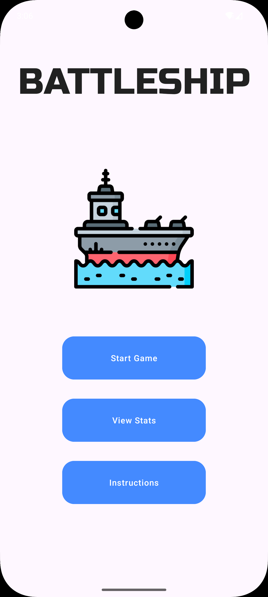
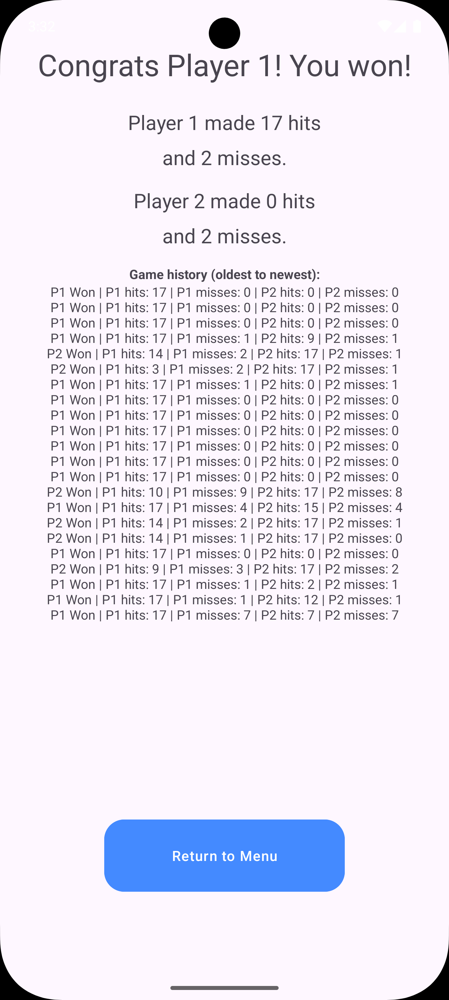

# Battleship (Android)

A two-player Battleship game built for Android, designed for local play on a single device where players take turns passing the device.

---

## Game Screens

  
  &nbsp;&nbsp;&nbsp;&nbsp;&nbsp;&nbsp;
  

---

## Ship Placement

Players manually place their ships on a grid before the game begins.  
Ships can be rotated and positioned with clear visual feedback to prevent invalid placement.

https://github.com/user-attachments/assets/d8f671fd-db8b-4be9-8c90-8a7f1b244a77

---

## Gameplay

Once both players have placed their ships, the game switches to turn-based play.  
Players take turns firing shots, with hits and misses clearly indicated on the board.

[https://github.com/stchangov/Battleship/issues/2#issue-3736334412](https://github.com/user-attachments/assets/b69b1c5e-3686-43d0-8130-b590f6e6d737)

---

## Features

- Local two-player gameplay on a single device
- Interactive ship placement with rotation
- Turn-based firing system
- Visual indicators for hits and misses
